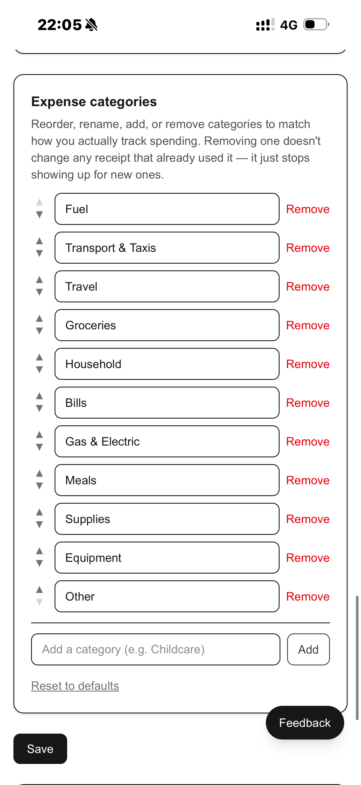
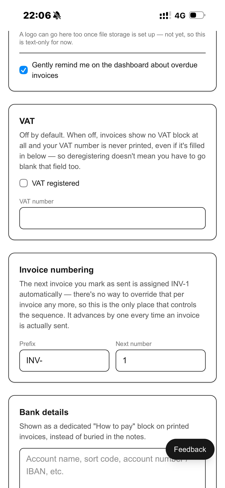
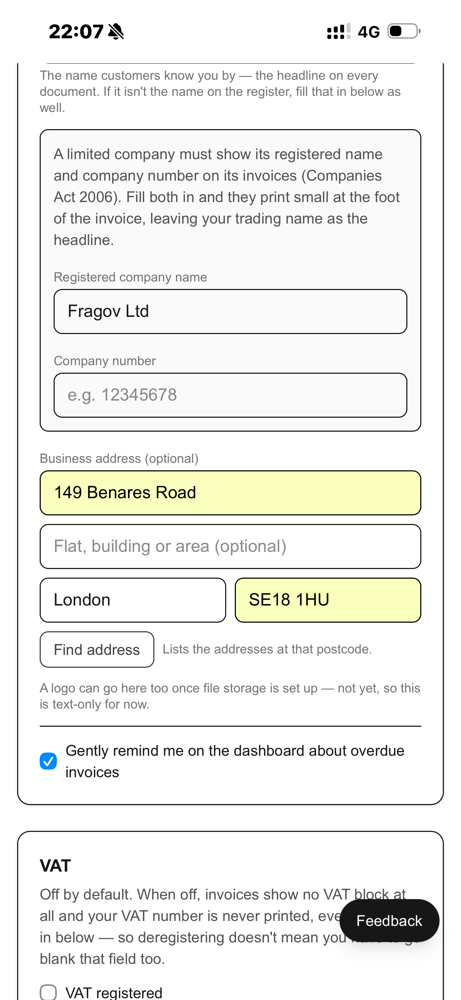
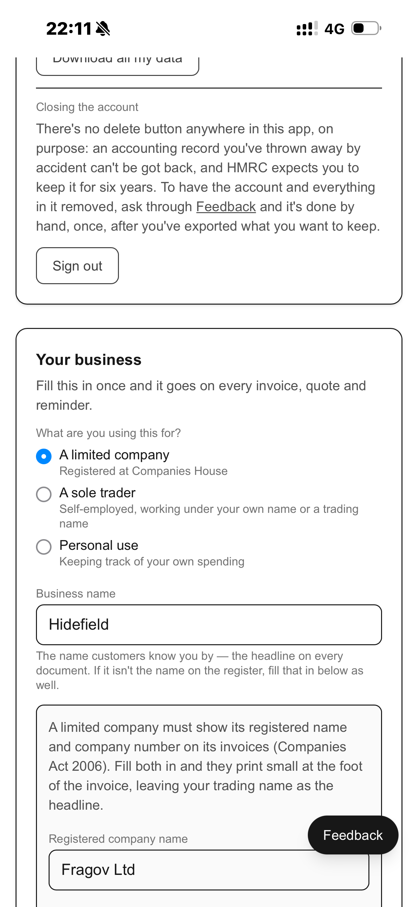

# Fix on INVOICE   
  
  
SETTINGS   
  
  
[New Recording](Attachments/765EBDCB-CED8-4A2C-A5EF-869A9872B757.m4a)  
  
  
  
  
  
[New Recording 2](Attachments/0E2E1A1E-E9CD-487E-B94A-B363E42972C7.m4a)  
  
  
  
  
  
[New Recording 3](Attachments/4845255B-1D8D-48D2-83FD-B3153B9D9947.m4a)  
[New Recording 4](Attachments/EC7E0F0E-F366-44E5-A48A-0C1D8BBD2AA7.m4a)  
  
  
  
  
  
[New Recording 5](Attachments/8CE61DB0-2D43-43A1-BB5F-CD3C5F04D061.m4a)  
  
  
